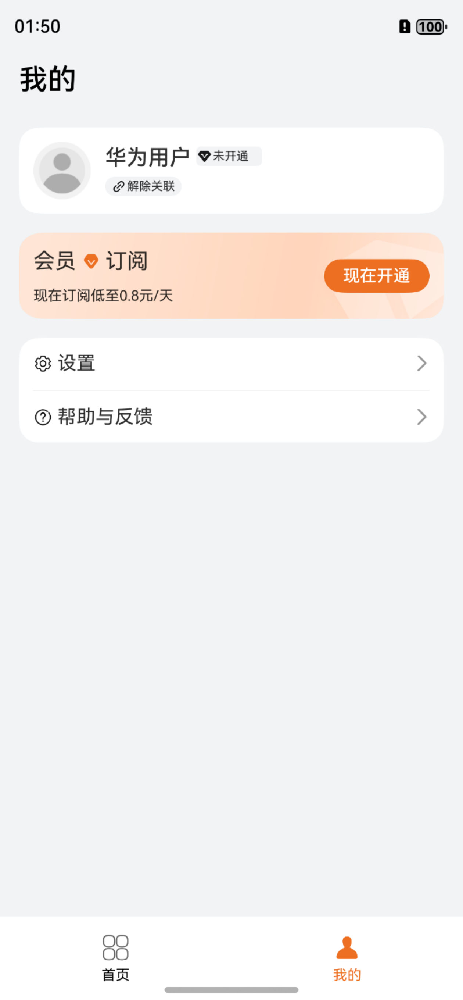

# 拍摄美化（图像美化）应用模板快速入门

## 目录

- [功能介绍](#功能介绍)
- [环境要求](#环境要求)
- [快速入门](#快速入门)
- [示例效果](#示例效果)
- [权限要求](#权限要求)
- [开源许可协议](#开源许可协议)


## 功能介绍

您可以基于此[模板](#模板)直接定制应用/元服务，也可以挑选此模板中提供的多种[组件](#组件)使用，从而降低您的开发难度，提高您的开发效率。

### 模板

本模板为图片美化应用提供了常用功能的开发样例，提供了图片美颜、裁剪、添加文字、滤镜、贴纸等功能。模板主要分首页、我的两大模块：

* 首页：包含图片美化和拼图2大入口，以及图片美化的美颜、裁剪、文字、滤镜、贴纸入口。

* 我的：提供账号管理、开通会员、设置、帮助与反馈等功能。

本模板已集成华为账号、华为支付等服务，只需做少量配置和定制即可快速实现华为账号登录、华为支付。

**【注意】**

* 本模版登录中获取验证码场景为模拟场景，真实场景以业务实际场景为准。
* 本模版在未配置华为账号一键登录的情况下为保证正常使用本模版，均采用模拟用户信息登录，实际开发中请以具体业务为准。

| 首页                                                        | 我的                                                        |
|-----------------------------------------------------------|-----------------------------------------------------------|
|  |  |


本模板主要页面及核心功能如下所示：

```ts
美拍
 ├─ 首页
 │    ├─ 图片美化
 │    │    ├─ 图片美颜
 │    │    ├─ 图片裁剪
 │    │    ├─ 添加文字
 │    │    ├─ 添加滤镜   
 │    │    └─ 添加贴纸
 │    │ 
 │    ├─ 图片拼接
 │    │    ├─ 图片拼接
 │    │    ├─ 海报拼接
 │    │    └─ 模板拼接
 │    │ 
 │    └─ 图片保存
 │         └─ 保存至相册
 │    
 └─ 我的
      ├─ 登录
      │
      ├─ 开通会员
      │
      ├─ 设置
      │    ├─ 账号设置
      │    ├─ 保存设置
      │    │   ├─ 图片格式
      │    │   └─ 图片质量
      │    └─ 服务条款
      └─ 帮助与反馈
```

本模板工程代码结构如下所示：

```ts
FitnessCenter  
├─common
│  └─src
│     └─main
│        └─ets
│           ├─components
│           │     IconAndTextView.ets                        // 图标文字显示组件
│           │     TitleBar.ets                               // 公共标题栏组件
│           │      
│           └─model
│                 DateUtil.ets                               // 日期时间工具
│                 MockService.ets                            // 模拟数据服务类
│                 PageParams.ets                             // 公共页面参数类
│                                 
├─components
│  └─picture_collage
│     └─src
│         └─main
│            └─ets
│               ├─components
│               │      CollageBar.ets                        // 拼接操作栏组件
│               │      DirectCollageComponent.ets            // 直接拼图图片区组件
│               │      ImageShowComponent.ets                // 图片展示公共组件
│               │      PosterCollage.ets                     // 海报拼图图片区组件
│               │      
│               ├─model
│               │      CollageModel.ets                      // 拼图参数类
│               │      
│               └─views
│                       PictureCollage.ets                   // 图片拼接组件
├─product
│  └─phone
│      └─src
│          └─main
│             └─ets
│                ├─entryability
│                │      EntryAbility.ets                     // 应用主窗口
│                │      
│                ├─pages
│                │      Index.ets                            // 应用入口页
│                │      MainPage.ets                         // 首页
│                │      Mine.ets                             // 我的
│                │
│                └─view
│                       StackView.ets                        // 首页图片堆叠组件
│                      
└─scenes
   ├─collage
   │   └─src
   │       └─main
   │          └─ets
   │             ├─generated
   │             │      RouterBuilder.ets                     // 路由构建类
   │             │      
   │             ├─model
   │             │      Constants.ets                         // 常量类
   │             │      
   │             └─pages
   │      	            PictureCollagePage.ets                // 图片拼接页
   ├─personal
   │   └─src
   │       └─main
   │          └─ets
   │             ├─components
   │             │      AggregatedPaymentPicker.ets           // 支付渠道模态弹框
   │             │      AgreementView.ets                     // 协议授权弹框
   │             │      DraftCard.ets                         // 草稿箱卡片组件
   │             │      MarterialCenterCard.ets               // 素材中心卡片组件
   │             │      OpenVipCard.ets                       // 开通会员卡片组件
   │             │      PrivacyTextSpan.ets                   // 协议文本组件
   │             │      SettingAndHelpCard.ets                // 帮助与反馈卡片组件
   │             │      UserCard.ets                          // 用户信息卡片组件
   │             │      
   │             ├─generated
   │             │      RouterBuilder.ets                     // 路由构建类
   │             │      
   │             ├─model
   │             │      Channel.ets                           // 渠道类
   │             │      Constants.ets                         // 常量类
   │             │      ErrorCodeEntity.ets                   // 请求错误码类
   │             │      
   │             └─pages
   │                    Help.ets                              // 帮助与反馈页
   │                    OpenVip.ets                           // 开通vip页
   │                    OtherLogin.ets                        // 其他方式登录页
   │                    QuickLoginPage.ets                    // 华为一键登录页
   │                    SaveSetting.ets                       // 保存设置页
   │                    Setting.ets                           // 设置页
   │                    Terms.ets                             // 服务条款页
   │
   └─picture_beautification
       └─src
           └─main
              └─ets
                 ├─components
                 │      AddTextComponent.ets                   // 添加文字组件
                 │      AddTextToolBar.ets                     // 添加文字工具栏
                 │      BeautyActionBar.ets                    // 图片美化总操作栏
                 │      BeautyActionSimplyBar.ets              // 图片美化简化操作栏
                 │      BeautyToolBar.ets                      // 一键美颜工具栏
                 │      CarouseCutToolBar.ets                  // 图片裁剪工具栏
                 │      FilterToolBar.ets                      // 图片滤镜工具栏
                 │      StickerComponent.ets                   // 添加贴纸组件
                 │      StickerToolBar.ets                     // 添加贴纸工具栏
                 │      TextEditDialog.ets                     // 编辑文字弹窗
                 │    
                 ├─generated
                 │      RouterBuilder.ets                     // 路由构建类
                 │      
                 ├─model
                 │      BeautificationParam.ets               // 图片美化页面参数
                 │      Constants.ets                         // 常量类
                 │      
                 ├─pages
          	     │      PictureBeautification.ets             // 图片美化页
          	     │
          	     └─util
          	            ImageProcessingUtil.ets               // 图片处理工具类
    
```


### 组件

本模板中提供了多种组件，您可以按需选择合适的组件进行使用，所有组件存放在工程根目录的components下。

| 组件         | 描述                                                         | 使用指导                                         |
| ------------ | ------------------------------------------------------------ | ------------------------------------------------ |
| 图片拼接组件 | 本组件提供了图片拼接的能力，包括直接拼图、模板拼接、海报拼接等。 | [使用指导](components/picture_collage/README.md) |

## 环境要求

### 软件
* DevEco Studio版本：DevEco Studio 5.0.4 Release及以上
* HarmonyOS SDK版本：HarmonyOS 5.0.4 Release及以上
### 硬件
* 设备类型：华为手机（直板机）
* HarmonyOS版本：HarmonyOS 5.0.4 Release及以上

## 快速入门

在运行此模板前，需要完成以下配置：

1. 在AppGallery Connect创建应用，将包名配置到模板中。

   a. 参考[创建应用](https://developer.huawei.com/consumer/cn/doc/app/agc-help-createharmonyapp-0000001945392297)为应用创建APPID，并将APPID与应用进行关联。

   b. 返回应用列表页面，查看应用的包名。

   c. 将根目录下AppScope/app.json5文件中的bundleName替换为创建应用的包名。

2. 配置华为账号服务。

   a. 将应用的client ID配置到product/phone模块的src/main/module.json5文件，详细参考：[配置Client ID](https://developer.huawei.com/consumer/cn/doc/harmonyos-guides/account-client-id)。

   b. 添加公钥指纹，详细参考：[配置应用证书指纹](https://developer.huawei.com/consumer/cn/doc/app/agc-help-signature-info-0000001628566748#section5181019153511)。

   c. 申请华为账号一键登录所需的quickLoginMobilePhone权限，详细参考：[配置scope权限](https://developer.huawei.com/consumer/cn/doc/harmonyos-guides/account-config-permissions)。

3. 注册字体。图片美化添加文字功能如需其它字体需自行添加，可按以下方式导入字体。

   a. 将需要导入的字体文件放到product/phone/src/main/resources/rawfile下。

   b. 在EntryAbility.ets的onCreate方法中按照以下示例注册字体。
   ```typescript
   onCreate(want: Want, launchParam: AbilityConstant.LaunchParam): void    {
    hilog.info(0x0000, 'testTag', '%{public}s', 'Ability onCreate');
    // 注册自定义字体
    let fontCollection = text.FontCollection.getGlobalInstance()
    fontCollection.loadFontSync('宋体',$rawfile('simsun.ttf'))
   }
   ```

###  运行调试工程
1. 连接调试手机和PC。

2. 对应用[手工签名](https://developer.huawei.com/consumer/cn/doc/harmonyos-guides/ide-signing#section297715173233)。

3. 菜单选择“Run > Run 'phone' ”或者“Run > Debug 'phone' ”，运行或调试模板工程。

## 示例效果

[功能展示录屏](./screenshots/sample.mp4)

## 权限要求

* 网络权限：ohos.permission.INTERNET

## 开源许可协议

该代码经过[Apache 2.0 授权许可](http://www.apache.org/licenses/LICENSE-2.0)。
