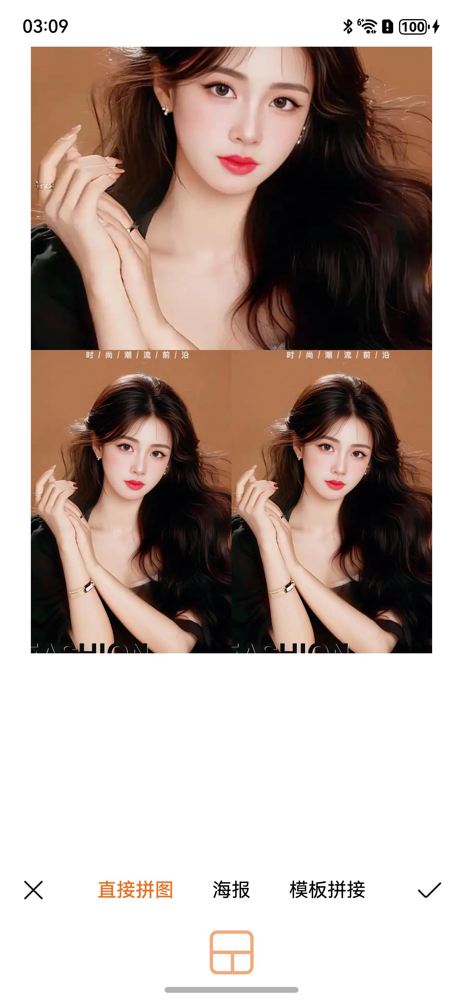
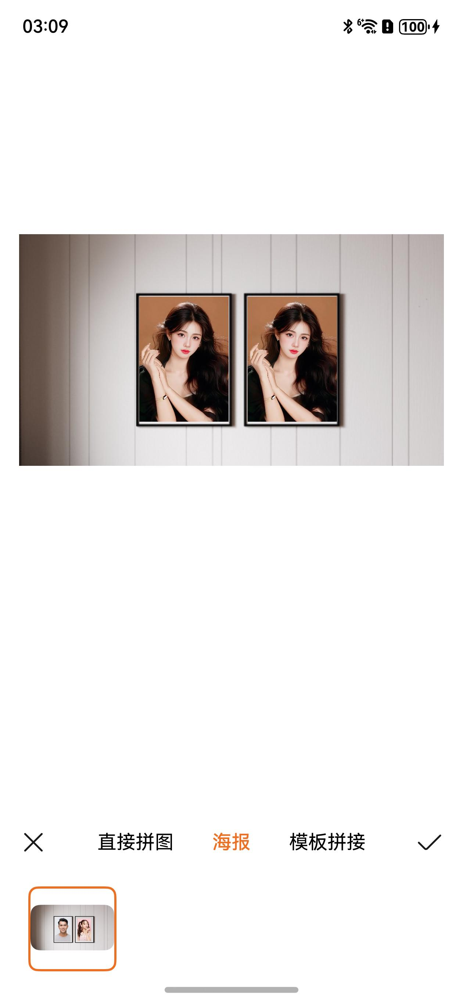
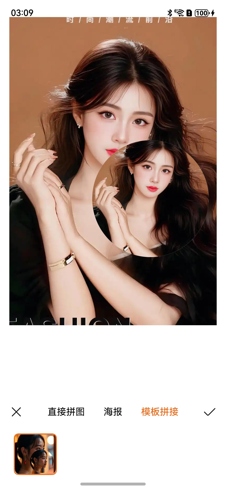

# 图片拼接组件快速入门

## 目录

- [简介](#简介)
- [使用](#使用)
- [API参考](#API参考)
- [示例代码](#示例代码)

## 简介

图片拼接组件，支持图片按网格直接拼接、海报拼接、模板拼接。

| 直接拼接 | 海报拼接 | 模板拼接 |
| -------- | -------- | -------- |
|          |          |           |


## 使用

1. 安装组件。

   ```typescript
   // 在项目根目录build-profile.json5填写picture_collage路径
     "modules": [
       {
         "name": "picture_collage",
         "srcPath": "./components/picture_collage"
      }
     ]
   ```

   ```typescript
   "dependencies": {
     "picture_collage" : "file:./components/picture_collage"
   }
   ```

3. 引入组件。

   ```typescript
    import { PictureCollage } from 'picture_collage';
   ```

4. 调用组件，详细参数配置说明参见[API参考](#API参考)。

   ```typescript
   // 引入组件
   import { PictureCollage } from 'picture_collage';
   import { photoAccessHelper } from '@kit.MediaLibraryKit';
   import { BusinessError } from '@kit.BasicServicesKit';
   
   @Entry
   @Component
   struct Index {
      @State imageUris:string[] = []
   
      aboutToAppear(): void {
         // 设置图片选择器选项
         const photoSelectOptions = new photoAccessHelper.PhotoSelectOptions();
         photoSelectOptions.MIMEType = photoAccessHelper.PhotoViewMIMETypes.IMAGE_TYPE;
         photoSelectOptions.maxSelectNumber = 3;
         // 创建并实例化图片选择器
         const photoViewPicker = new photoAccessHelper.PhotoViewPicker();
         // 选择图片并获取图片URI
         photoViewPicker.select(photoSelectOptions).then((result: photoAccessHelper.PhotoSelectResult) => {
            this.imageUris = result.photoUris
         }).catch((err: BusinessError) => {
            console.error(`PhotoViewPicker.select failed with err: ${err.code}, ${err.message}`);
         });
      }
      
      build() {
         Column() {
            PictureCollage({
               imageUris: this.imageUris,
            });
         }
      }
   }
   ```

## API参考

### 子组件

无

### 接口

PictureCollage(options?: PictureCollageOptions)

图片拼接组件，支持图片按网格直接拼接、海报拼接、模板拼接。

**参数：**

| 参数名     | 类型                                                  | 必填 | 说明         |
|---------|-----------------------------------------------------|----|------------|
| options | [PictureCollageOptions](#PictureCollageOptions对象说明) | 否  | 图片拼接组件的参数。 |

### PictureCollageOptions对象说明

| 名称                | 类型                                      | 必填 | 说明           |
|-------------------|-----------------------------------------|----|--------------|
| imageUris         | string[]                                | 是  | 传入待拼接图片uri列表 |
| directTemplates   | [DirectTemplate[]](#DirectTemplate对象说明) | 否  | 按网格拼接的网格样式列表 |
| posterList        | [PosterInfo](#PosterInfo对象说明)           | 否  | 海报拼接的海报样式列表  |
| templateList      | [PosterInfo](#PosterInfo对象说明)           | 否  | 模板拼接的海报样式列表  |

### DirectTemplate对象说明

| 名称              | 类型                                                                                                    | 必填 | 说明             |
|-----------------|-------------------------------------------------------------------------------------------------------|----|----------------|
| imageResource   | [ResourceStr](https://developer.huawei.com/consumer/cn/doc/harmonyos-references/ts-types#resourcestr) | 是  | 网格模板图片resource |
| rowsTemplate    | string                                                                                                | 是  | 网格行数量和占比       |
| columnsTemplate | string                                                                                                | 是  | 网格列数量和占比       |
| areas           | [AreaConfig[]](#AreaConfig对象说明)                                                                       | 是  | 网格各空间配置对象列表    |

### AreaConfig对象说明

| 名称       | 类型     | 必填 | 说明     |
|----------|--------|----|--------|
| id       | string | 是  | 网格空间id |
| rowStart | number | 是  | 起始行    |
| rowEnd   | number | 是  | 结束行    |
| colStart | number | 是  | 起始列    |
| colEnd   | number | 是  | 结束列    |

### PosterInfo对象说明

| 名称           | 类型                                                                                                     | 必填 | 说明           |
|--------------|--------------------------------------------------------------------------------------------------------|----|--------------|
| showImage    | [ResourceStr](https://developer.huawei.com/consumer/cn/doc/harmonyos-references/ts-types#resourcestr)  | 是  | 样例图片resource |
| collageParts | [PosterCollagePart[]](#PosterCollagePart对象说明)                                                          | 是  | 海报可拼接区域信息    |
| isVip        | boolean                                                                                                | 否  | 是否vip        |
| posterImage  | [ResourceStr](https://developer.huawei.com/consumer/cn/doc/harmonyos-references/ts-types#resourcestr)  | 否  | 背景图片resource |

### PosterCollagePart对象说明

| 名称                   | 类型      | 必填 | 说明      |
|----------------------|---------|----|---------|
| collagePositionX     | Length  | 是  | 区域起始x坐标 |
| collagePositionY     | Length  | 是  | 区域起始Y坐标 |
| collageWidth         | Length  | 是  | 区域宽度    |
| collageHeight        | Length  | 是  | 区域长度    |
| borderRadius         | Length  | 是  | 区域圆角    |

## 示例代码

### 示例1（传入不同模板拼接）

本示例通过传入多个模板实现图片直接拼接，根据选择图片数量展示不同的模板，切换模板实现不同拼接。
   ```typescript
   // 引入组件
   import { PictureCollage } from 'picture_collage';
   import { photoAccessHelper } from '@kit.MediaLibraryKit';
   import { BusinessError } from '@kit.BasicServicesKit';
   
   @Entry
   @Component
   struct Index {
      @State imageUris:string[] = []
   
      aboutToAppear(): void {
         // 设置图片选择器选项
         const photoSelectOptions = new photoAccessHelper.PhotoSelectOptions();
         photoSelectOptions.MIMEType = photoAccessHelper.PhotoViewMIMETypes.IMAGE_TYPE;
         photoSelectOptions.maxSelectNumber = 3;
         // 创建并实例化图片选择器
         const photoViewPicker = new photoAccessHelper.PhotoViewPicker();
         // 选择图片并获取图片URI
         photoViewPicker.select(photoSelectOptions).then((result: photoAccessHelper.PhotoSelectResult) => {
            this.imageUris = result.photoUris
         }).catch((err: BusinessError) => {
            console.error(`PhotoViewPicker.select failed with err: ${err.code}, ${err.message}`);
         });
      }
      
      build() {
         Column() {
            PictureCollage({
               imageUris: this.imageUris,
               directTemplates: [
                  {
                     rowsTemplate: '1fr 1fr',
                     columnsTemplate: '1fr 1fr',
                     imageResource: $r('app.media.direct4'),
                     areas: [
                        {
                           id: 'left',
                           rowStart: 0,
                           rowEnd: 1,
                           colStart: 0,
                           colEnd: 0
                        }, // 跨两行
                        {
                           id: 'right',
                           rowStart: 0,
                           rowEnd: 1,
                           colStart: 1,
                           colEnd: 1
                        }
                     ]
                  },
                  {
                     rowsTemplate: '1fr 1fr',
                     columnsTemplate: '1fr 1fr',
                     imageResource: $r('app.media.direct5'),
                     areas: [
                        {
                           id: 'top',
                           rowStart: 0,
                           rowEnd: 0,
                           colStart: 0,
                           colEnd: 1
                        },
                        {
                           id: 'bottom',
                           rowStart: 1,
                           rowEnd: 1,
                           colStart: 0,
                           colEnd: 1
                        }
                     ]
                  },
                  {
                     rowsTemplate: '1fr 1fr',
                     columnsTemplate: '1fr 1fr',
                     imageResource: $r('app.media.direct1'),
                     areas: [
                        {
                           id: 'top',
                           rowStart: 0,
                           rowEnd: 0,
                           colStart: 0,
                           colEnd: 1
                        }, // 跨两列
                        {
                           id: 'leftBottom',
                           rowStart: 1,
                           rowEnd: 1,
                           colStart: 0,
                           colEnd: 0
                        },
                        {
                           id: 'rightBottom',
                           rowStart: 1,
                           rowEnd: 1,
                           colStart: 1,
                           colEnd: 1
                        }
                     ]
                  },
                  {
                     rowsTemplate: '1fr 1fr',
                     columnsTemplate: '1fr 1fr',
                     imageResource: $r('app.media.direct2'),
                     areas: [
                        {
                           id: 'leftTop',
                           rowStart: 0,
                           rowEnd: 0,
                           colStart: 0,
                           colEnd: 0
                        },
                        {
                           id: 'rightTop',
                           rowStart: 0,
                           rowEnd: 0,
                           colStart: 1,
                           colEnd: 1
                        },
                        {
                           id: 'bottom',
                           rowStart: 1,
                           rowEnd: 1,
                           colStart: 0,
                           colEnd: 1
                        }
                     ]
                  },
                  {
                     rowsTemplate: '1fr 1fr',
                     columnsTemplate: '1fr 1fr',
                     imageResource: $r('app.media.direct3'),
                     areas: [
                        {
                           id: 'left',
                           rowStart: 0,
                           rowEnd: 1,
                           colStart: 0,
                           colEnd: 0
                        },
                        {
                           id: 'rightTop',
                           rowStart: 0,
                           rowEnd: 0,
                           colStart: 1,
                           colEnd: 1
                        },
                        {
                           id: 'rightBottom',
                           rowStart: 1,
                           rowEnd: 1,
                           colStart: 1,
                           colEnd: 1
                        }
                     ]
                  }
               ]
            });
         }
      }
   }
   ```
